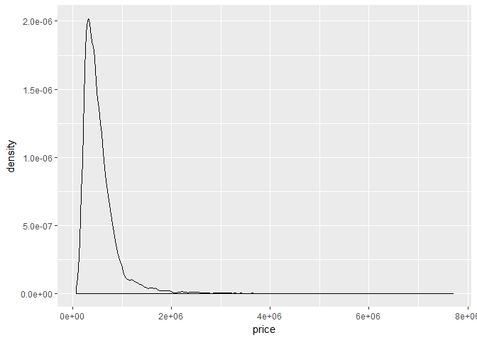
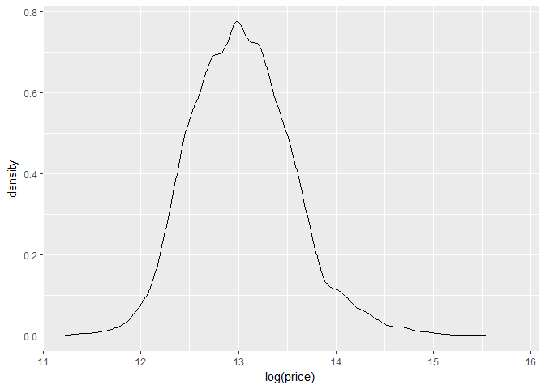
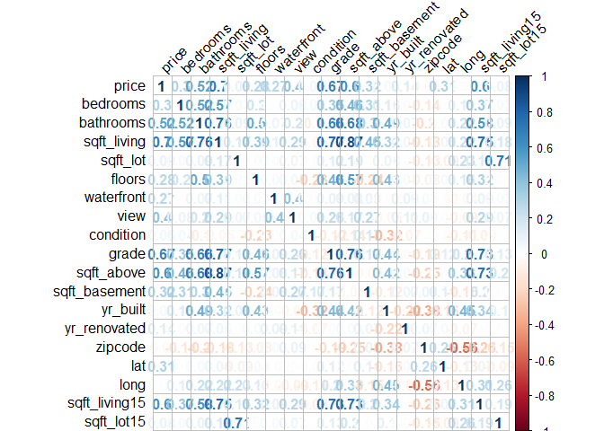
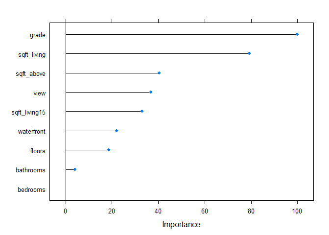
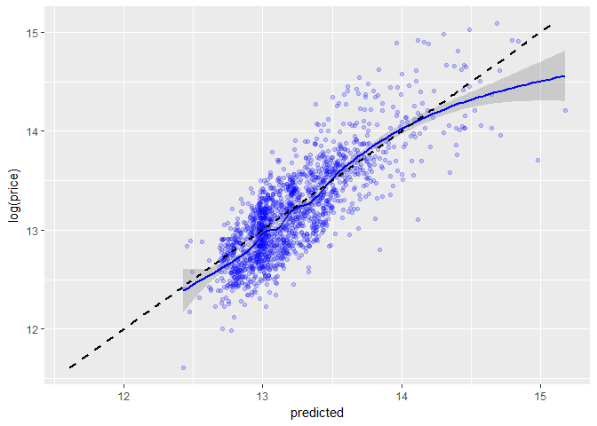
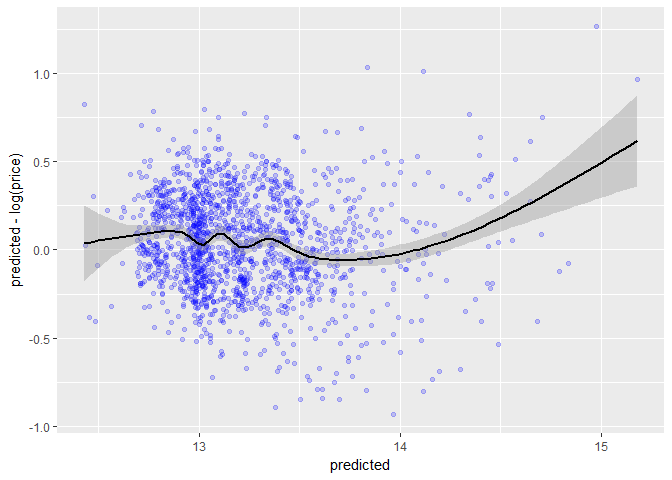

HousePrice\_Prediction\_using\_R
================

[Fitting a linear model using R's caret package to predict house prices](https://github.com/MNoorFawi/Linear_Regression_with_R_caret)
----------------------------------------------------------------------

we first load the train data and the test data without the "id" and "date" columns (the data is already splitted into two datasets "train" and "test" with different extensions)

``` r
library(readxl)
house_train <- read.csv("home_data-train .csv", 
                        header = FALSE,
                        stringsAsFactors = FALSE)[, -c(1:2)]
house_test <- data.frame(read_excel("HomePrices-Test.xlsx", 
                         sheet = "Sheet1"))[, -c(1:2)]
names(house_train) <- names(house_test)
```

exploring the data
------------------

``` r
str(house_train)
```

    ## 'data.frame':    19998 obs. of  19 variables:
    ##  $ price        : int  221900 538000 180000 604000 510000 1225000 257500 291850 229500 323000 ...
    ##  $ bedrooms     : int  3 3 2 4 3 4 3 3 3 3 ...
    ##  $ bathrooms    : num  1 2.25 1 3 2 4.5 2.25 1.5 1 2.5 ...
    ##  $ sqft_living  : int  1180 2570 770 1960 1680 5420 1715 1060 1780 1890 ...
    ##  $ sqft_lot     : int  5650 7242 10000 5000 8080 101930 6819 9711 7470 6560 ...
    ##  $ floors       : num  1 2 1 1 1 1 2 1 1 2 ...
    ##  $ waterfront   : int  0 0 0 0 0 0 0 0 0 0 ...
    ##  $ view         : int  0 0 0 0 0 0 0 0 0 0 ...
    ##  $ condition    : int  3 3 3 5 3 3 3 3 3 3 ...
    ##  $ grade        : int  7 7 6 7 8 11 7 7 7 7 ...
    ##  $ sqft_above   : int  1180 2170 770 1050 1680 3890 1715 1060 1050 1890 ...
    ##  $ sqft_basement: int  0 400 0 910 0 1530 0 0 730 0 ...
    ##  $ yr_built     : int  1955 1951 1933 1965 1987 2001 1995 1963 1960 2003 ...
    ##  $ yr_renovated : int  0 1991 0 0 0 0 0 0 0 0 ...
    ##  $ zipcode      : int  98178 98125 98028 98136 98074 98053 98003 98198 98146 98038 ...
    ##  $ lat          : num  47.5 47.7 47.7 47.5 47.6 ...
    ##  $ long         : num  -122 -122 -122 -122 -122 ...
    ##  $ sqft_living15: int  1340 1690 2720 1360 1800 4760 2238 1650 1780 2390 ...
    ##  $ sqft_lot15   : int  5650 7639 8062 5000 7503 101930 6819 9711 8113 7570 ...

plotting the price variable
---------------------------

``` r
library(ggplot2)
ggplot(house_train) + geom_density(aes(x = price))
```



it seems that the price variable distribution is skewed and this indicates that we have to get log(price)

``` r
ggplot(house_train) + geom_density(aes(x = log(price)))
```



we then create a correlation map to know which variables affect the price of a house

``` r
library(corrplot)
library(dplyr)
cor_mat <- cor(house_train) %>% round(digits = 2)
corrplot(cor_mat, method = 'number',
         tl.srt = 45, tl.col = 'black')
#method = "shade", type = "upper", shade.col = NA, diag = FALSE

# 2d density plot
#normal geom_point + stat_density2d(aes(color = ..level..), #geom = "raster" / "polygon")
```



it seems that some variables have weak correlation with the price, so we remove them

``` r
unnecessary <- c('sqft_lot', 'condition', 'yr_built', 'yr_renovated',
'zipcode', 'long', 'lat', 'sqft_lot15', 'sqft_basement')

train <- house_train[, -which(names(house_train) %in% unnecessary)]
test <- house_test[, -which(names(house_test) %in% unnecessary)]
```

then before fitting the model we define functions to extract RSquared and RMSE values from our model. RMSE = root-mean-square error "the lower the better" RSQ = RSquared "the greater the better"

``` r
rmse <- function(y, x){
  sqrt(mean((y - x)^2))
}

rsq <- function(y, x) { 
  1 - sum((y - x) ^ 2) / sum((y - mean(y)) ^ 2) 
}
```

MODEL FITTING
-------------

``` r
library(caret)
control <- trainControl(method = "cv", number = 10)
# train the model
model <- train(log(price) ~ ., data = train, method = "lm", 
               trControl = control, verbose = FALSE) 
```

exploring model summary
-----------------------

``` r
model
```

    ## Linear Regression 
    ## 
    ## 19998 samples
    ##     9 predictor
    ## 
    ## No pre-processing
    ## Resampling: Cross-Validated (10 fold) 
    ## Summary of sample sizes: 17999, 17998, 17998, 17998, 17999, 17999, ... 
    ## Resampling results:
    ## 
    ##   RMSE      Rsquared 
    ##   0.342187  0.5818805
    ## 
    ## Tuning parameter 'intercept' was held constant at a value of TRUE
    ## 

``` r
summary(model)
```

    ## 
    ## Call:
    ## lm(formula = .outcome ~ ., data = dat, verbose = FALSE)
    ## 
    ## Residuals:
    ##      Min       1Q   Median       3Q      Max 
    ## -1.67311 -0.24658  0.00735  0.23401  1.31939 
    ## 
    ## Coefficients:
    ##                 Estimate Std. Error t value Pr(>|t|)    
    ## (Intercept)    1.118e+01  2.190e-02 510.555  < 2e-16 ***
    ## bedrooms      -6.731e-03  3.267e-03  -2.060   0.0394 *  
    ## bathrooms     -2.098e-02  5.390e-03  -3.892 9.96e-05 ***
    ## sqft_living    2.761e-04  7.407e-06  37.271  < 2e-16 ***
    ## floors         6.629e-02  6.383e-03  10.385  < 2e-16 ***
    ## waterfront     3.543e-01  2.988e-02  11.857  < 2e-16 ***
    ## view           6.736e-02  3.650e-03  18.456  < 2e-16 ***
    ## grade          1.716e-01  3.688e-03  46.542  < 2e-16 ***
    ## sqft_above    -1.494e-04  7.452e-06 -20.048  < 2e-16 ***
    ## sqft_living15  1.006e-04  6.011e-06  16.732  < 2e-16 ***
    ## ---
    ## Signif. codes:  0 '***' 0.001 '**' 0.01 '*' 0.05 '.' 0.1 ' ' 1
    ## 
    ## Residual standard error: 0.3421 on 19988 degrees of freedom
    ## Multiple R-squared:  0.5822, Adjusted R-squared:  0.582 
    ## F-statistic:  3094 on 9 and 19988 DF,  p-value: < 2.2e-16

important variables in our model
--------------------------------

``` r
vimp <- varImp(model)
vimp
```

    ## lm variable importance
    ## 
    ##               Overall
    ## grade         100.000
    ## sqft_living    79.160
    ## sqft_above     40.438
    ## view           36.860
    ## sqft_living15  32.985
    ## waterfront     22.024
    ## floors         18.715
    ## bathrooms       4.119
    ## bedrooms        0.000

``` r
plot(vimp)
```



surprisingly number of bedrooms has no effect at all on the price, meanwhile the grade is the most important variable in the model.

Generalizing the model and getting predictions
----------------------------------------------

we first fit the model over the training data to know how well the model fits the data from which it has been trained.

``` r
train$predicted <- predict(model, newdata = train)
cor(log(train$price), train$predicted)
```

    ## [1] 0.7629894

``` r
rmse(log(train$price), train$predicted)
```

    ## [1] 0.3420504

``` r
rsq(log(train$price), train$predicted)
```

    ## [1] 0.5821528

the model seems to fit the training data well; let's see how well it can be generalized over the test data that it hasn't seen yet.

``` r
test$predicted <- predict(model, newdata = test)
cor(log(test$price) ,test$predicted)
```

    ## [1] 0.8122232

``` r
rmse(log(test$price), test$predicted)
```

    ## [1] 0.2832296

``` r
rsq(log(test$price), test$predicted)
```

    ## [1] 0.6496261

the model has even better results over the test data than what it had with the training one. this tells that we have a pretty good model to use over new data

visualizing the predicted vs actual data
----------------------------------------

to get a sense of how well and close our model fits the data we plot the actual price values as a function of the predicted values with a straight line indicating the ideal relationship it should have and a smoothed one indicating how it actually fits the data.

``` r
ggplot(data = test, aes(x = predicted, y = log(price))) +
  geom_point(alpha = 0.2, color = "blue") +
  geom_smooth(aes(x = predicted,
                  y = log(price)), color="blue") +
  geom_line(aes(x = log(price),
                y = log(price)), color = "black", 
            linetype = 2, size = 1) 
```

    ## `geom_smooth()` using method = 'gam'



our model isn't so far from the ideal one. this is good.

it also good to look at the residuals.
======================================

the residual is the difference between the observed value of the dependent variable "log(price)" and the predicted value "predicted" if the points in a residual plot are randomly dispersed around the horizontal axis, a linear regression model is appropriate for the data; otherwise, a non-linear model is more appropriate.

``` r
ggplot(data = test, aes(x = predicted,
                      y = predicted - log(price))) +
  geom_point(alpha = 0.2, color = "blue") +
  geom_smooth(aes(x = predicted,
                  y = predicted - log(price)),
              color="black")
```

    ## `geom_smooth()` using method = 'gam'



the residuals are pretty randomly dispersed so this means that our model is so fine.

